# nigerian-customer-segmentation
Customer segmentation of Nigerian retail and e-commerce customers using K-Prototypes clustering.
#  Nigerian Retail & E-Commerce Customer Segmentation

##  Project Overview

This project applies unsupervised machine learning to segment customers within a Nigerian retail and e-commerce dataset based on their purchasing behaviour and customer characteristics.

The main objective is to identify groups of customers with similar characteristics and purchasing patterns, allowing businesses to better understand their customer base and develop more targeted marketing and customer-retention strategies.

Because the dataset contains both numerical and categorical variables, the K-Prototypes clustering algorithm was used to perform customer segmentation.

## Project Objectives

- Identify distinct customer segments.
- Analyze customer purchasing behaviour.
- Understand differences in customer spending patterns.
- Profile the characteristics of each customer cluster.
- Develop business recommendations based on the identified segments.

## Tools & Technologies

- Python
- Pandas
- NumPy
- Matplotlib
- Scikit-learn
- K-Prototypes
- Jupyter Notebook

## Methodology

1. Data cleaning
2. Exploratory data analysis
3. Outlier analysis
4. Feature transformation
5. Feature scaling
6. K-Prototypes clustering
7. Cluster profiling
8. Business recommendations

## Project Structure

Nigerian_Retail_And_Ecommerce_Customer_Segmentation_Data/
│
├── Data/
│   └── original_nigerian_retail_and_ecommerce_customer_segmentation_data.csv
│
├── Images/
│   └── Charts and visualizations
│
├── Notebooks/
│   └── nigeria_retail_and_ecommerce_customer_segmentation.ipynb
│
├── Outputs/
│   └── Final clustering output
│
└── README.md

## Visualizations

### Numerical Distributions

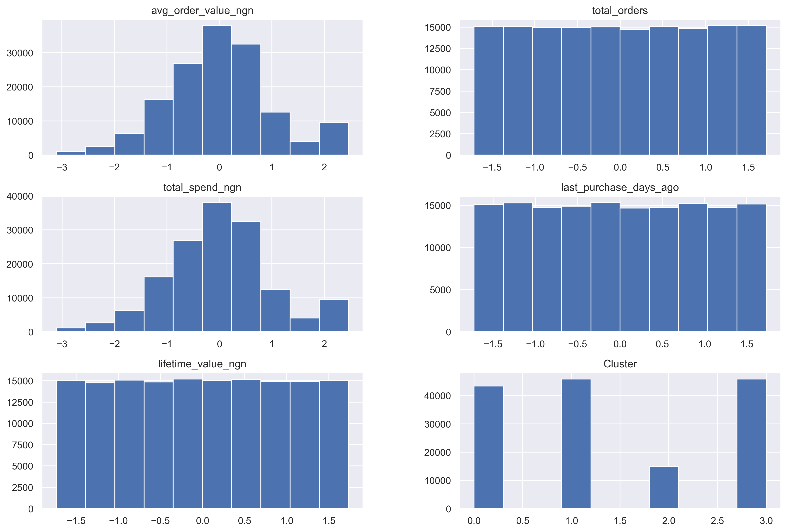

Distribution plots of the key numeric features (Total Spend, Avg Order Value, Lifetime Value, Total Orders, Last Purchase Days Ago) before transformation, revealing right-skew that motivated log transformation during preprocessing.

### Outlier Detection

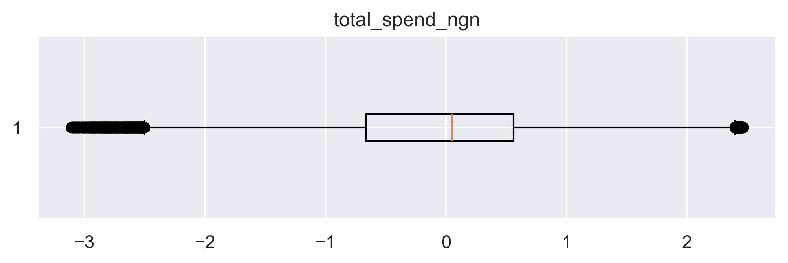

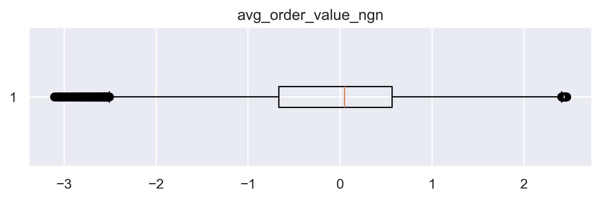

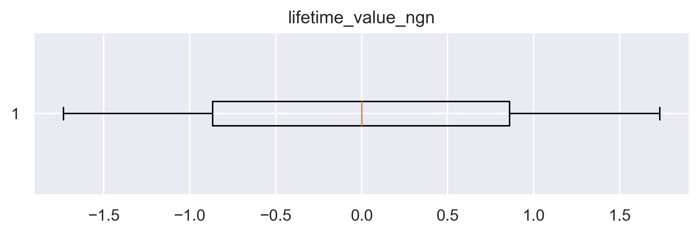

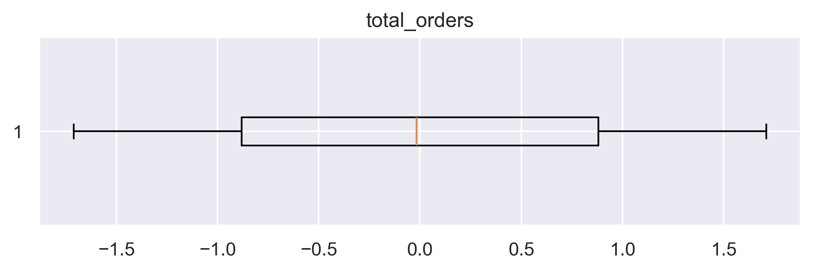

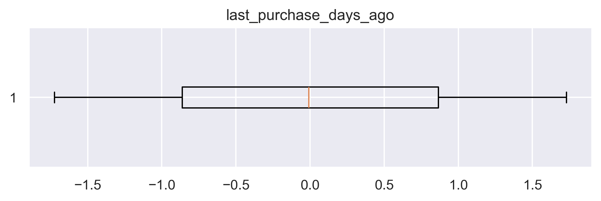

Boxplots used to identify outliers across the five core numeric features on the 150,000-row dataset. Extreme values were reviewed rather than blindly dropped, since high spenders/lifetime value customers are business-relevant, not noise.

### Categorical Breakdown

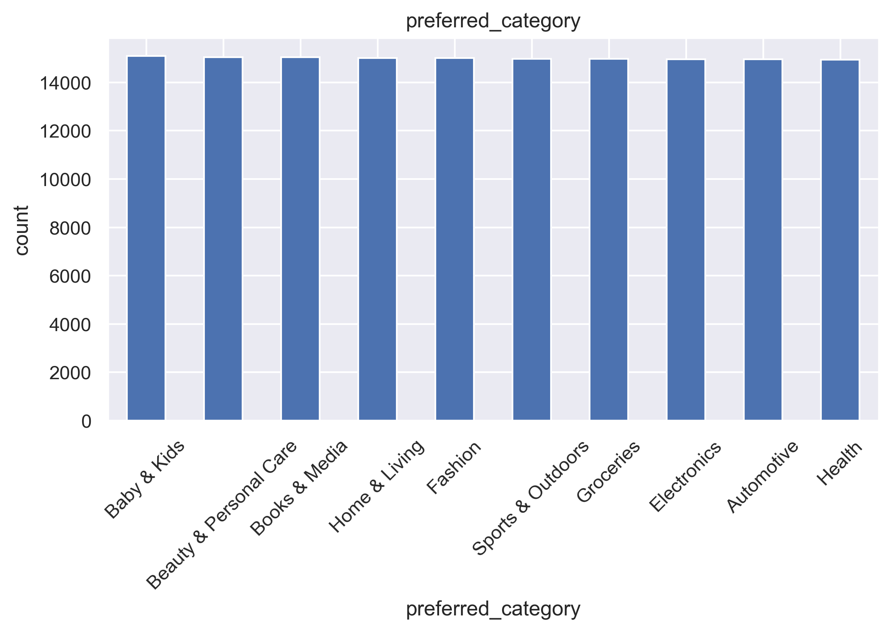

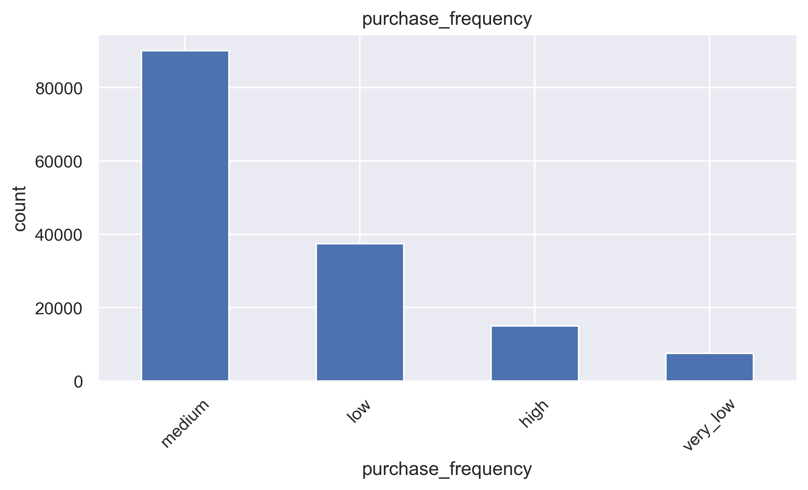

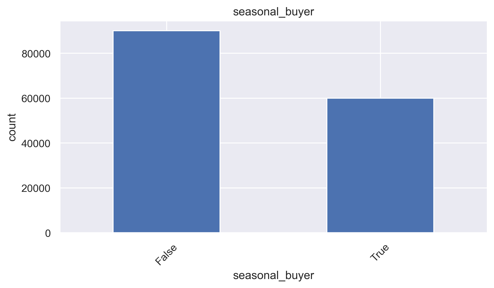

Distribution of customers across preferred product category, purchase frequency, and seasonal buying behavior — the categorical features fed into K-Prototypes alongside the scaled numeric ones.

### Correlation Heatmap

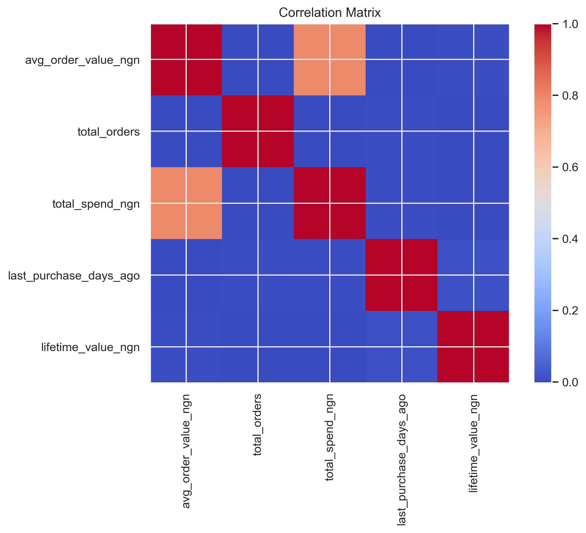

Correlation matrix of numeric features, used to check for multicollinearity before clustering and to understand which spending behaviors move together.

### Elbow Method

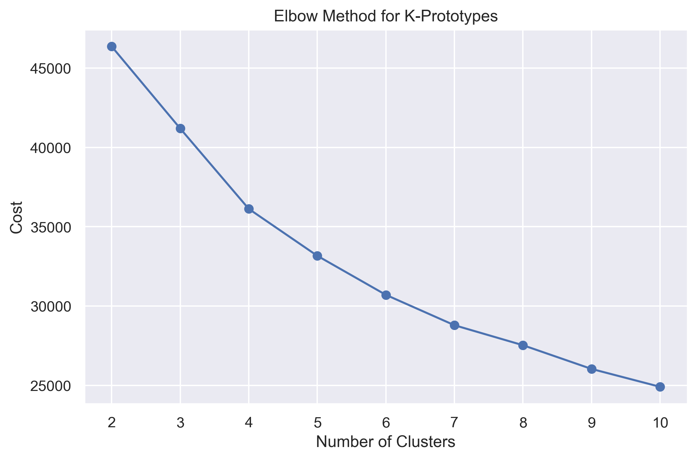

Cost curve across k values for K-Prototypes. While the elbow suggested a reasonable range, k=4 was ultimately selected based on Adjusted Rand Index (0.4601) and cluster interpretability rather than the elbow alone.

### Cluster Visualization

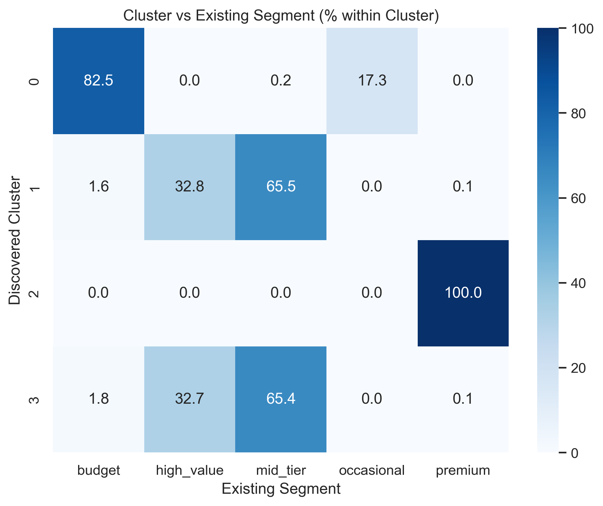

Heatmap of average feature values per cluster, used to profile and label the four segments: **Budget/Occasional Shoppers**, **Frequent Mid-Spenders**, **Premium Customers**, and **Occasional Big-Ticket Buyers**.

### Final Cluster Distribution

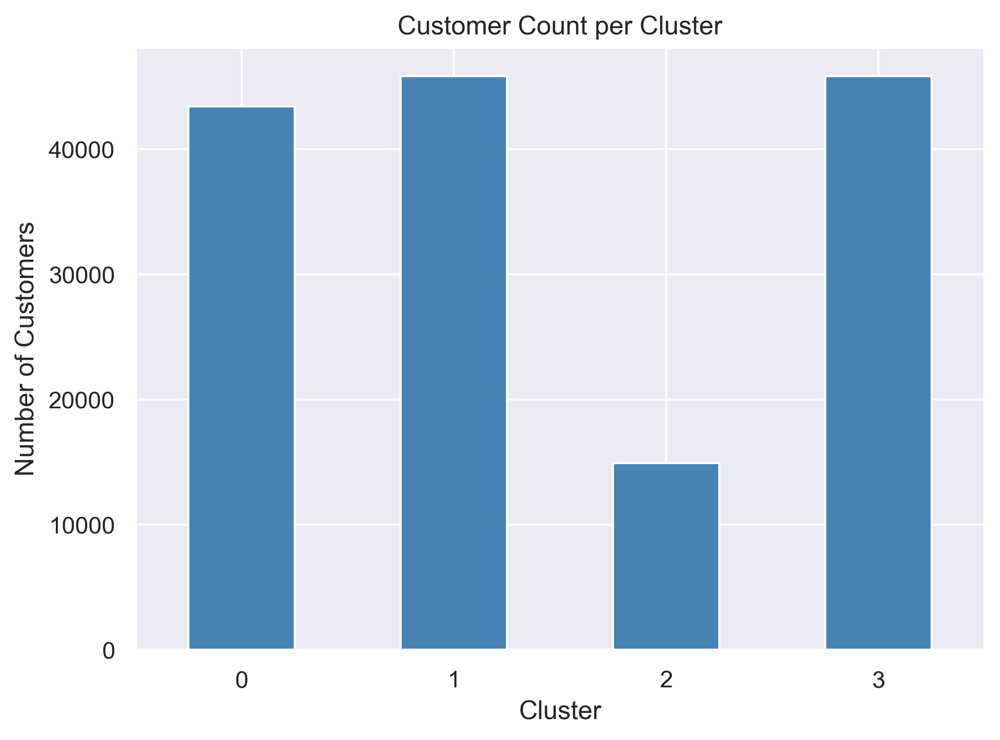

Distribution of customers across the four final clusters, showing relative segment sizes across the customer base.

## Results

The final K-Prototypes model produced four customer clusters.

Detailed cluster characteristics, descriptive segment names, and business recommendations are presented in the project analysis.

## Author

**Lawal Yinka**

Aspiring Data Scientist
